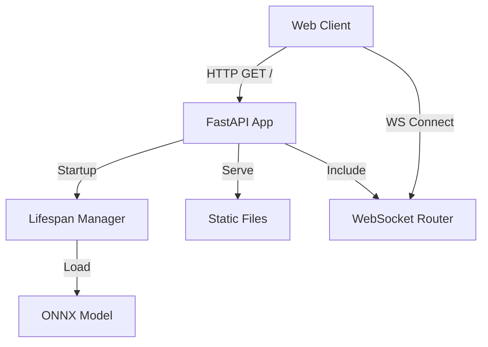

# FastAPI Application Structure

#api #fastapi #architecture

The backend of the Arabic Sign Language Recognition system is built using **FastAPI**, a modern, high-performance web framework for building APIs with Python based on standard Python type hints.

## Overview

The application is structured to serve both a RESTful API and a WebSocket interface for real-time communication. It is designed to be lightweight, asynchronous, and easily deployable via Docker.

## Call Graph

## Key Components

### 1. Application Lifecycle (`main.py`)

The application uses an asynchronous **lifespan context manager** to handle startup and shutdown events.

- **Startup**:
    - Loads the customized **ONNX Runtime** inference session.
    - Initializes the model from the path specified by `ONNX_CHECKPOINT_FILENAME`.
    - Stores the loaded model in `app.state.onnx_model` for global access.
- **Shutdown**:
    - Cleans up the model resources.
    - Ensures graceful termination.

### 2. Middleware

- **CORS (Cross-Origin Resource Sharing)**:
    - configured using `CORSMiddleware`.
    - Allowed origins are controlled via the `DOMAIN_NAME` environment variable.
    - Permits all methods and headers to facilitate flexible frontend interaction.

### 3. Routing

The application defines several types of routes:

- **Static Files**:
    - Serves the frontend application (HTML, CSS, JS) from the `static/` directory.
    - Mounted at `/static` and also serves `index.html` at the root `/`.
- **WebSocket**:
    - A dedicated router is included for `ws_live_signs` to handle real-time inference.
- **Utility**:
    - Endpoints for `favicon.ico` and Chrome DevTools configuration.

## Related Documentation

- [[../source/api/main_py|main.py Source Documentation]]
- [[../source/api/websocket_py|websocket.py Source Documentation]]
- [[../deployment/environment_configuration|Environment Configuration]]
