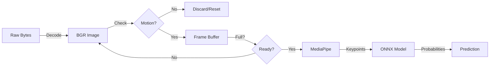

# Live Processing Pipeline

#api #pipeline #processing #cv

The **Live Processing Pipeline** is the engine that converts a stream of raw video frames into meaningful sign language predictions. It orchestrates frame decoding, motion detection, buffering, keypoint extraction, and model inference.

## Processing Flow

## Pipeline Stages

### 1. Frame Acquisition
- **Input**: Raw bytes from the WebSocket.
- **Action**: Decoded into a NumPy array (BGR image) using `cv2.imdecode`.
- **Optimization**: Decoding happens in a separate thread to avoid blocking the async event loop.

### 2. Motion Detection
To save computational resources and reduce false positives, the system processes frames only when motion is detected.

- **Mechanism**: A `MotionDetector` class compares the current frame with a running average of previous frames.
- **Threshold**: If the pixel difference exceeds a set threshold (sensitivity), the frame is flagged as "active".
- **Reset**: If no motion is detected for a certain period, the system resets its state and clears the frame buffer.

### 3. Frame Buffering
The model requires a sequence of frames (temporal context) to recognize a sign, not just a single static image.

- **Buffer Size**: Fixed sequence length (e.g., `SEQ_LEN` frames).
- **Logic**:
    - Valid frames (with motion) are appended to a ring buffer.
    - When the buffer reaches the required length, it is passed to the inference stage.
    - A sliding window approach allows for continuous recognition.

### 4. Keypoint Extraction (MediaPipe)
Raw images are processed by **MediaPipe** to extract skeletal landmarks.

- **Components**:
    - **Face**: 468 landmarks (reduced to relevant subset).
    - **Pose**: 33 landmarks (shoulders, arms).
    - **Hands**: 21 landmarks per hand.
- **Normalization**: Landmarks are normalized relative to the image center or specific body points (e.g., nose) to ensuring scale invariance.

### 5. Inference
The extracted keypoints are formatted into a tensor and passed to the **ONNX Runtime** session.

- **Input**: Shape `(Batch, Time, Channels, Keypoints)`.
- **Model**: Attention-based BiLSTM.
- **Output**: Softmax probability distribution over the 502 sign classes.

### 6. Post-Processing
- **Decoding**: The class index with the highest probability is mapped to its text label (e.g., "HELLO").
- **Confidence Threshold**: Predictions below a certain confidence score (e.g., 0.6) are discarded or marked as "Unknown".

## Related Documentation

- [[../source/api/live_processing_py|live_processing.py Source Code]]
- [[../source/core/mediapipe_utils_py|mediapipe_utils.py Source Code]]
- [[../source/api/cv2_utils_py|cv2_utils.py Source Code]]
