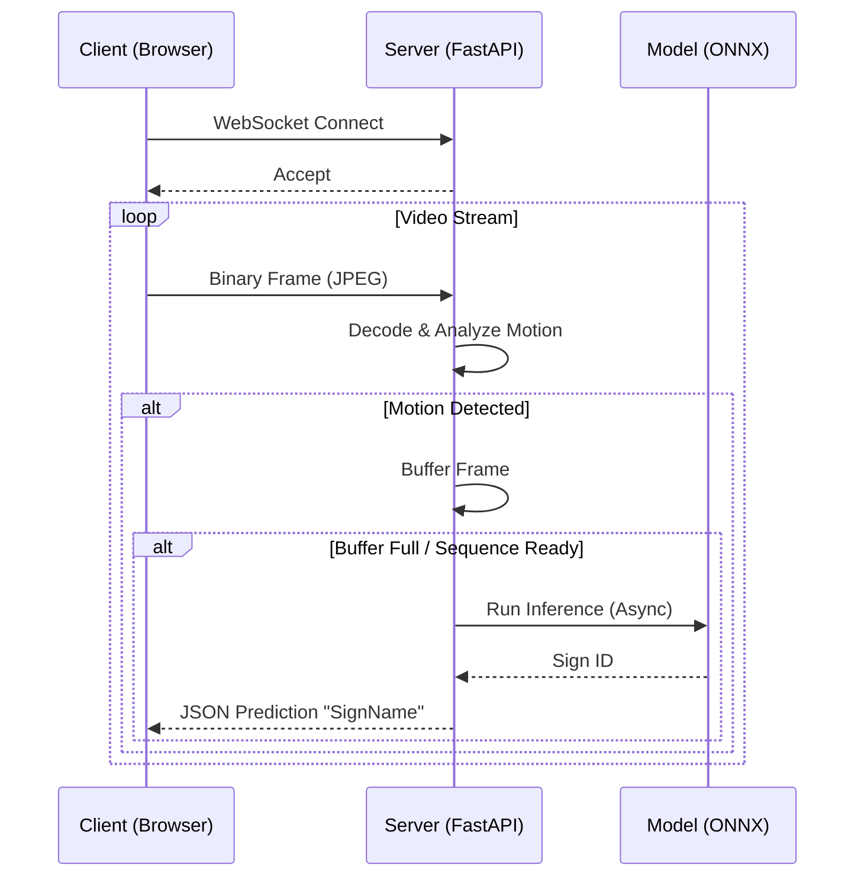

# WebSocket Communication Protocol

#api #websocket #real-time

Real-time sign language recognition relies on a persistent, low-latency communication channel between the web client and the inference server. This is achieved using the **WebSocket Protocol**.

## Protocol Overview

The communication is bidirectional but primarily driven by the client sending video frames and the server responding with inference results.

## Sequence Diagram



### Connection Lifecycle

1.  **Handshake**: The client initiates a connection to `/live-signs`.
2.  **State Initialization**: The server initializes a session-specific state, including:
    - `last_inference_time`: Timestamp of the last processed frame.
    - `sign_frames`: A ring buffer to store incoming frames for the temporal model.
    - `motion_detected`: Boolean flag to trigger inference.
3.  **Data Loop**: The server enters an infinite loop waiting for messages (frames).
4.  **Termination**: The connection is closed when the client disconnects or an error occurs.

## Message Format

### Client -> Server

Messages sent by the client are binary blobs containing **JPEG-encoded images**.

- **Format**: binary (bytes)
- **Content**: Compressed image frame from the user's camera.
- **Frequency**: Frame rate of the client's camera (e.g., 30 FPS).

### Server -> Client

Messages sent by the server are **JSON text strings** containing predictions or status updates.

#### Prediction Payload
```json
{
  "type": "prediction",
  "payload": "HELLO",
  "probability": 0.95,
  "inference_time": 0.045
}
```

#### Status Payload (Example)
```json
{
  "type": "status",
  "message": "Motion Detected",
  "code": "MOTION_START"
}
```

## Concurrency and Performance

To maintain real-time performance, the server utilizes **asynchronous programming** (`asyncio`) combined with a **Thread Pool**.

- **Async/Await**: Used for handling WebSocket I/O (receiving frames, sending responses) without blocking the event loop.
- **Thread Pool (`run_in_executor`)**: CPU-intensive tasks like image decoding (`cv2.imdecode`), preprocessing, and model inference are offloaded to a thread pool. This prevents the main event loop from freezing, ensuring the server remains responsive to ping/pong frames and other connections.

## Related Documentation

- [[../source/api/websocket_py|websocket.py Source Code]]
- [[../api/live_processing_pipeline|Live Processing Pipeline]]
- [[../frontend/websocket_client_implementation|WebSocket Client Implementation]]
