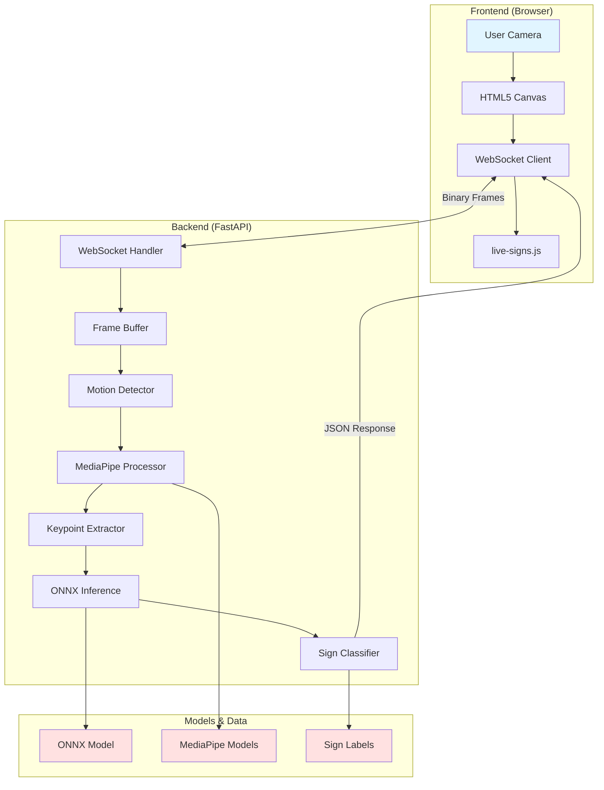
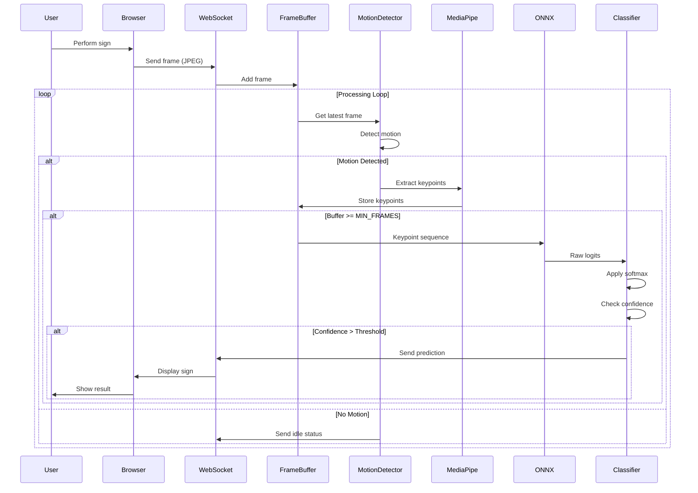
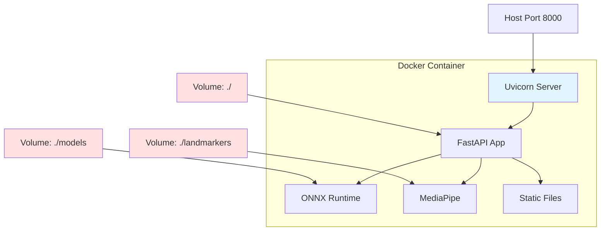

# Architecture Overview

#architecture #system-design #components

This document provides a high-level overview of the Arabic Sign Language Recognition system architecture, component interactions, and data flow.

## System Architecture



## Component Overview

### 1. Frontend Layer

**Technology**: HTML5, CSS3, JavaScript (Vanilla)

**Components**:
- **Camera Handler**: Captures video frames from webcam
- **WebSocket Client**: Establishes real-time connection to backend
- **UI Controller**: Displays recognized signs and confidence scores
- **Frame Encoder**: Converts canvas frames to JPEG for transmission

**Key Files**:
- [[source/frontend/live-signs-js|live-signs.js]] - Main client logic
- [[source/frontend/index-html|index.html]] - UI structure
- [[source/frontend/styles-css|styles.css]] - Styling

See [[frontend/web-interface-design|Web Interface Design]] for details.

### 2. API Layer

**Technology**: FastAPI, Uvicorn, WebSockets

**Components**:
- **FastAPI Application**: HTTP server and routing
- **WebSocket Handler**: Manages real-time frame processing
- **CORS Middleware**: Handles cross-origin requests
- **Lifespan Manager**: Model loading and cleanup

**Key Files**:
- [[source/api/main-py|main.py]] - Application setup and routes
- [[source/api/websocket-py|websocket.py]] - WebSocket handler
- [[source/api/run-py|run.py]] - Entry point

**Functions**:
- `lifespan()` - Loads ONNX model on startup
- `ws_live_signs()` - Main WebSocket handler
- `live_signs_ui()` - Serves frontend HTML

See [[api/fastapi-application|FastAPI Application]] for details.

### 3. Processing Pipeline

**Technology**: OpenCV, MediaPipe, NumPy

**Components**:

#### Frame Buffer
Circular buffer for managing incoming frames during inference.

**Key Class**: `FrameBuffer` in [[source/api/live-processing-py|live_processing.py]]

**Methods**:
- `add_frame()` - Adds frame to buffer
- `get_frame()` - Retrieves frame by index
- `clear()` - Resets buffer

#### Motion Detection
Detects movement to trigger sign recognition.

**Key Class**: `MotionDetector` in [[source/api/cv2-utils-py|cv2_utils.py]]

**Methods**:
- `detect()` - Compares consecutive frames
- `convert_small_gray()` - Preprocesses frames

#### Keypoint Extraction
Extracts pose, face, and hand landmarks using MediaPipe.

**Key Class**: `LandmarkerProcessor` in [[source/core/mediapipe-utils-py|mediapipe_utils.py]]

**Methods**:
- `extract_frame_keypoints()` - Extracts all landmarks
- `init_mediapipe_landmarkers()` - Initializes MediaPipe models

See [[core/mediapipe-integration|MediaPipe Integration]] for details.

### 4. Model Layer

**Technology**: PyTorch, ONNX Runtime

**Components**:

#### Model Architecture
Attention-based Bidirectional LSTM for sequence classification.

**Key Classes** in [[source/modelling/model-py|model.py]]:
- `AttentionBiLSTM` - Main model architecture
- `SpatialGroupEmbedding` - Feature embedding layer
- `ResidualBiLSTMBlock` - BiLSTM building block
- `AttentionPooling` - Attention-based pooling

**Model Pipeline**:
1. **Input**: Keypoint sequences (batch, seq_len, features)
2. **Embedding**: Spatial group embedding
3. **BiLSTM**: 4 residual BiLSTM layers
4. **Attention**: Multi-head self-attention
5. **Pooling**: Attention-based temporal pooling
6. **Output**: Class logits (502 classes)

See [[models/architecture-design|Model Architecture]] for details.

#### Inference Engine
ONNX Runtime for optimized CPU inference.

**Key Functions** in [[source/modelling/model-py|model.py]]:
- `load_onnx_model()` - Loads ONNX model
- `onnx_inference()` - Runs inference

### 5. Data Layer

**Technology**: PyTorch, NumPy, Pandas

**Components**:

#### Dataset Loaders
- **LazyDataset**: On-demand loading from NPZ files
- **MmapDataset**: Memory-mapped dataset for efficient access

**Key Files**:
- [[source/data/lazy-dataset-py|lazy_dataset.py]]
- [[source/data/mmap-dataset-py|mmap_dataset.py]]

#### Data Preparation
- Video preprocessing
- Keypoint extraction from videos
- Dataset splitting (train/val/test)

**Key Files**:
- [[source/data/data-preparation-py|data_preparation.py]]
- [[source/data/prepare-npz-kps-py|prepare_npz_kps.py]]

See [[data/data-preparation-pipeline|Data Preparation Pipeline]] for details.

## Data Flow

### Real-Time Recognition Flow



### Training Flow

```mermaid
graph LR
    A[Raw Videos] --> B[Video Preprocessing]
    B --> C[MediaPipe Extraction]
    C --> D[NPZ Keypoints]
    D --> E[Dataset Loader]
    E --> F[DataLoader]
    F --> G[Model Training]
    G --> H[PyTorch Checkpoint]
    H --> I[ONNX Export]
    I --> J[ONNX Model]
    J --> K[Production Inference]
    
    style A fill:#e1f5ff
    style J fill:#e1ffe1
    style K fill:#ffe1e1
```



## Configuration Management

### Environment Variables

Managed through `.env` file:

```env
ONNX_CHECKPOINT_FILENAME  # Model filename
DOMAIN_NAME               # CORS allowed origin
LOCAL_DEV                 # Local vs Kaggle paths
USE_CPU                   # Force CPU execution
```

See [[deployment/environment-configuration|Environment Configuration]] for all options.

### Constants

Defined in [[source/core/constants-py|constants.py]]:

```python
SEQ_LEN = 50              # Sequence length
FEAT_NUM = 184            # Number of features
FEAT_DIM = 4              # Feature dimensions (x, y, z, v)
DEVICE = "cpu" | "cuda"   # Execution device
```

## Deployment Architecture

### Docker Deployment



**Features**:
- Hot reload enabled for development
- Volume mounts for code and models
- Automatic dependency installation
- Consistent environment across platforms

See [[deployment/docker-setup|Docker Setup]] for configuration.

## Performance Considerations

### Optimization Strategies

1. **ONNX Runtime**: Optimized inference engine
2. **CPU Execution**: Tuned for CPU performance
3. **Frame Buffering**: Circular buffer prevents memory overflow
4. **Motion Detection**: Reduces unnecessary processing
5. **Async Processing**: Non-blocking WebSocket communication
6. **Thread Pool**: Parallel keypoint extraction

### Bottlenecks

- **MediaPipe Processing**: ~20-30ms per frame
- **ONNX Inference**: ~10-20ms per sequence
- **Network Latency**: WebSocket frame transmission

## Security Considerations

- **CORS**: Configured allowed origins
- **WebSocket**: No authentication (add for production)
- **Input Validation**: Frame size and format checks
- **Resource Limits**: Frame buffer size limits

## Scalability

### Current Limitations
- Single-threaded WebSocket handler
- In-memory frame buffer
- No load balancing

### Future Improvements
- Multi-worker deployment
- Redis for session management
- Load balancer for multiple instances
- GPU acceleration for inference

## Related Documentation

- [[api/fastapi-application|FastAPI Application]]
- [[api/websocket-communication|WebSocket Communication]]
- [[core/mediapipe-integration|MediaPipe Integration]]
- [[models/architecture-design|Model Architecture]]
- [[deployment/docker-setup|Docker Setup]]

---

**Next Steps:**
- Explore [[api/live-processing-pipeline|Live Processing Pipeline]]
- Learn about [[models/training-process|Training Process]]
- Review [[source/api/websocket-py|WebSocket Implementation]]
