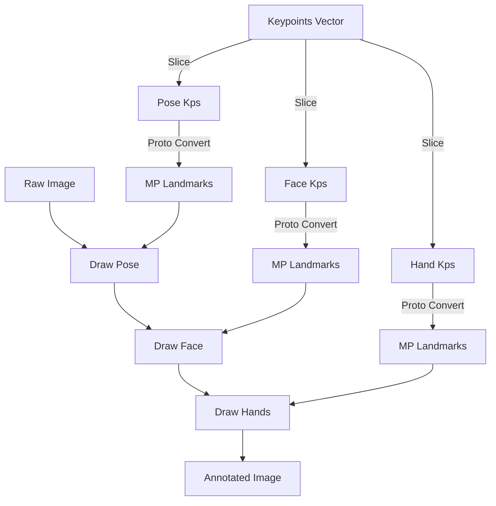

# Keypoint Visualization

#core #visualization #debugging

Visualizing the extracted keypoints is essential for debugging the pipeline, validating model input, and providing user feedback (e.g., "Skeleton" overlay on the video feed).

## Visualization Strategy

The `draw_kps.py` module provides utilities to draw landmarks and their connections directly onto OpenCV images.

### Drawing Layers

We layer the visualizations to ensure clarity:
1.  **Pose Connections**: Lines connecting shoulders, elbows, and wrists.
2.  **Face Mesh**: A tessellation mesh showing the face geometry.
3.  **Hand Skeleton**: Detailed bones of the fingers and palm.

### Components

#### 1. `draw_landmarks` Utility
We use MediaPipe's built-in `drawing_utils.draw_landmarks` but with custom styling (`DrawingSpec`).

- **Color Coding**: Different body parts can be assigned different colors for visual distinction.
- **Thickness**: Line thickness and circle radius are adjustable.

#### 2. Data Conversion
The drawing utilities expect MediaPipe Protocol Buffer (`pb2`) objects. Since our processing pipeline converts landmarks to NumPy arrays for the model, the visualization module includes helper functions to convert them back:

- `get_pose_lms_list()`: Numpy → `NormalizedLandmarkList`
- `get_hand_lms_list()`: Numpy → `NormalizedLandmarkList`

### Usage

The primary function `draw_all_kps_on_image` takes a raw image and a flat vector of keypoints, and returns the annotated image.

```python
annotated_frame = draw_all_kps_on_image(frame_rgb, keypoints_vector)
```

This is used in:
- **Training Visualization**: To inspect the data being fed into the model.
- **Data Preparation**: To verify the correctness of the dataset creation logic.
- **Frontend Debugging**: Optionally sent back to the client to visualize what the server "sees".

## Structure



## Related Documentation

- [[source/core/draw_kps_py|draw_kps.py Source Code]]
- [[source/core/mediapipe_utils_py|mediapipe_utils.py Source Code]]
