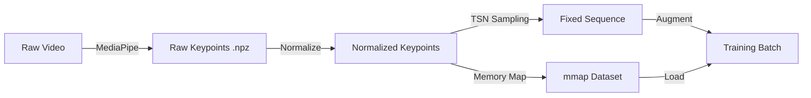

# Data Preparation Pipeline

#data #pipeline #preprocessing

The data preparation pipeline transforms raw video data into a format suitable for training deep learning models. It involves landmark extraction, normalization, augmentation, and storage optimization.

## Pipeline Steps

### 1. Landmark Extraction
We use **MediaPipe** to extract landmarks from every frame of every video in the dataset.
- **Script**: `prepare_npz_kps.py`
- **Output**: `.npz` files containing raw landmark coordinates.

### 2. Normalization
Raw landmarks are normalized to be invariant to scale and translation.
- **Center**: Subtract the nose (pose/face) or wrist (hand) coordinates.
- **Scale**: Divide by a reference distance (e.g., shoulder width).

### 3. Sampling (TSN)
Video sequences vary in length. We use **Temporal Segment Networks (TSN)** sampling to produce a fixed-length sequence (e.g., `SEQ_LEN=30`).
- **Training**: Randomly sample one frame from each segment (jittering) to augment temporal variance.
- **Testing**: Sample the center frame of each segment for deterministic evaluation.

### 4. Augmentation
To improve model generalization, we apply valid geometric transformations during training:
- **Horizontal Flip**: Mirrored with left/right landmark permutation.
- **Rotation**: Random rotation ±15 degrees.
- **Scaling**: Random scaling ±15%.
- **Translation**: Random shift in X/Y.

## Flowchart

## Related Documentation

- [[../source/data/data_preparation_py|data_preparation.py Source Code]]
- [[../source/data/prepare_npz_kps_py|prepare_npz_kps.py Source Code]]
