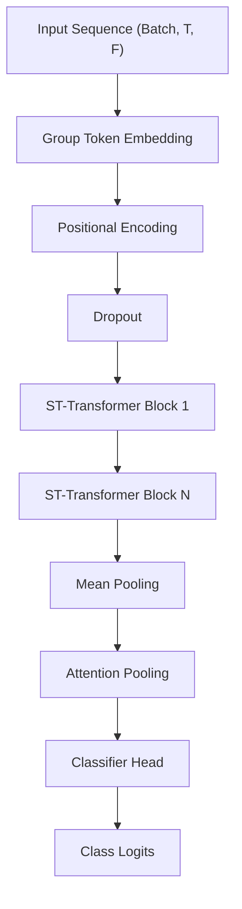

# Model Architecture Design

#model #architecture #deep-learning

The core of the recognition system is a **Spatial-Temporal Transformer (ST-Transformer)**, a dual-attention neural network designed for processing streaming skeletal data by modeling both spatial relationships between body parts and temporal dynamics over time.

## Architecture Overview

The model takes a sequence of spatial keypoints and outputs a probability distribution over the sign classes. It utilizes a hierarchical approach, first embedding anatomical groups and then processing them through alternating spatial and temporal attention mechanisms.

## Diagram

### 1. Group Token Embedding
The model independently projects anatomical regions (Pose, Face, Left Hand, Right Hand) into a shared latent space.

- **Separate Projections**: 4 independent Linear layers for each body part.
- **Normalization**: Batch Normalization on raw input features for stability.
- **Tokenization**: Body parts are stacked as "tokens" for spatial attention.
- **Part Embeddings**: Learnable parameter added to distinguish anatomical regions.

### 2. Positional Encoding
Since Transformers are permutation-invariant, a sinusoidal positional encoding is added to the temporal dimension to provide the model with information about the order of frames.

### 3. ST-Transformer Blocks
A stack of consecutive blocks that perform dual-stream attention:

- **Spatial Attention**: Multi-head self-attention operating across the body part tokens (Pose, Face, Hands) within each time step.
- **Temporal Attention**: Multi-head self-attention operating across the time steps for each body part.
- **MLP Head**: A position-wise feed-forward network with GELU activation.
- **Residual Connections & LayerNorm**: Each sub-layer (Spatial, Temporal, MLP) uses residual additions and normalization.

### 4. Self-Attention Pooling
Instead of simple averaging, the model uses a trainable **Attention Pooling** mechanism to aggregate the temporal dimension into a single context vector.

- **Trainable Weights**: Learns which frames are most informative for the sign.
- **Softmax Weighting**: Produces a normalized weighted sum of the hidden states.

### 5. Classification Head
- **Linear Layer**: Maps the pooled representation to the final class logits (502 signs).

## Related Documentation

- [[../source/modelling/model_py|model.py Source Code]]
- [[../models/training_process|Training Process]]
- [[../architecture_overview|Architecture Overview]]
