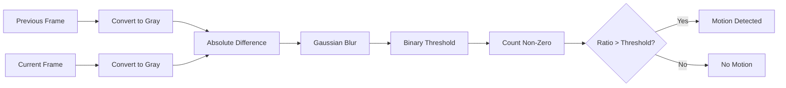

# source/api/cv2-utils.py

#source-code #api #opencv #motion-detection

**File Path**: `src/api/cv2_utils.py`

**Purpose**: OpenCV utilities for motion detection in video frames.

## Classes

### `MotionDetector`

#class #motion-detection #computer-vision

**Purpose**: Detects motion between consecutive video frames using frame differencing and Gaussian blur.

**Attributes**:
- `width` (int): Target frame width (default: 320)
- `height` (int): Target frame height (default: 240)
- `sigma_factor` (float): Gaussian blur sigma factor (default: 0.005)
- `thresh_val` (int): Binary threshold value (default: 20)
- `motion_thresh` (float): Motion ratio threshold (default: 0.001)
- `gaussian_kernel`: Pre-computed Gaussian kernel
- `logger`: Logger instance

**Methods**:

#### `__init__(width=320, height=240, sigma_factor=0.005, thresh_val=20, motion_thresh=0.001)`
Initializes motion detector with parameters.

**Implementation**:
- Computes Gaussian kernel size based on sigma_factor
- Pre-computes Gaussian kernel for efficiency

#### `convert_small_gray(frame) -> np.ndarray`
Converts frame to grayscale and resizes to target dimensions.

**Parameters**:
- `frame` (np.ndarray): Input frame

**Returns**: Grayscale resized frame

**Called By**: [[#MotionDetector.detect|detect()]]

**Calls**:
- `cv2.cvtColor()` - Converts to grayscale
- `cv2.resize()` - Resizes frame

#### `detect(prev_frame, frame) -> tuple[bool, np.ndarray]`

#method #motion-detection

**Purpose**: Detects motion between two consecutive frames.

**Parameters**:
- `prev_frame` (np.ndarray): Previous frame
- `frame` (np.ndarray): Current frame

**Returns**: Tuple of (has_motion, processed_frame)

**Algorithm**:
1. Convert both frames to small grayscale
2. Compute absolute difference
3. Apply Gaussian blur (separable filter)
4. Apply binary threshold
5. Calculate motion ratio (non-zero pixels / total pixels)
6. Compare ratio against threshold

**Called By**: [[source/api/websocket-py#ws_live_signs|ws_live_signs()]]

**Calls**:
- [[#MotionDetector.convert_small_gray|convert_small_gray()]]
- `cv2.absdiff()` - Frame difference
- `cv2.sepFilter2D()` - Separable Gaussian filter
- `cv2.threshold()` - Binary thresholding
- `cv2.countNonZero()` - Count non-zero pixels

**Performance**: ~5-10ms per frame pair

## Algorithm Details

### Motion Detection Pipeline



### Parameters Tuning

| Parameter       | Default | Purpose         | Effect                         |
| --------------- | ------- | --------------- | ------------------------------ |
| `width`         | 320     | Frame width     | Lower = faster, less accurate  |
| `height`        | 240     | Frame height    | Lower = faster, less accurate  |
| `sigma_factor`  | 0.005   | Blur strength   | Higher = more blur, less noise |
| `thresh_val`    | 20      | Threshold value | Higher = less sensitive        |
| `motion_thresh` | 0.001   | Motion ratio    | Higher = requires more motion  |

## Usage Example

```python
detector = MotionDetector()
prev_gray = np.array([])

for frame in video_frames:
    if prev_gray.size == 0:
        prev_gray = frame
        continue
    
    has_motion, gray = detector.detect(prev_gray, frame)
    prev_gray = gray
    
    if has_motion:
        # Process frame for sign detection
        pass
```

## Related Documentation

- [[source/api/websocket-py|websocket.py]] - Uses MotionDetector
- [[api/live-processing-pipeline|Live Processing Pipeline]]

---

**File Location**: `../../../src/api/cv2_utils.py`
