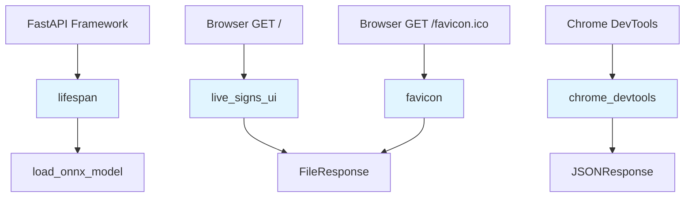

# source/api/main.py

#source-code #api #fastapi #application

**File Path**: `src/api/main.py`

**Purpose**: FastAPI application setup, lifespan management, routing, and middleware configuration.

## Overview

This module serves as the main entry point for the FastAPI application. It handles:
- Application lifespan (model loading/cleanup)
- CORS middleware configuration
- Static file serving
- Route definitions for the web interface

## Dependencies

```python
import os
from contextlib import asynccontextmanager
import fastapi
import uvicorn
from fastapi.middleware.cors import CORSMiddleware
from fastapi.responses import FileResponse, JSONResponse
from fastapi.staticfiles import StaticFiles
```

**Internal Imports**:
- [[source/api/websocket-py#websocket_router|websocket_router]] from `api.websocket`
- [[source/core/constants-py#MODELS_DIR|MODELS_DIR]] from `core.constants`
- [[source/modelling/model-py#load_onnx_model|load_onnx_model]] from `modelling.model`

## Functions

### `lifespan(app: fastapi.FastAPI)`

#function #async #context-manager

**Type**: Async context manager

**Purpose**: Manages application lifespan - loads ONNX model on startup and cleans up on shutdown.

**Parameters**:
- `app` (fastapi.FastAPI): The FastAPI application instance

**Yields**: None (context manager)

**Implementation**:
```python
@asynccontextmanager
async def lifespan(app: fastapi.FastAPI):
    print("Loading model...")
    ONNX_CHECKPOINT_FILENAME = (
        os.environ.get("ONNX_CHECKPOINT_FILENAME") or "ONNX_CHECKPOINT_FILENAME"
    )
    onnx_checkpoint_path = os.path.join(MODELS_DIR, ONNX_CHECKPOINT_FILENAME)
    app.state.onnx_model = load_onnx_model(onnx_checkpoint_path)

    yield

    print("Shutting down...")
    del app.state.onnx_model
```

**Called By**:
- FastAPI framework (automatic on startup/shutdown)

**Calls**:
- [[source/modelling/model-py#load_onnx_model|load_onnx_model()]] - Loads ONNX model from file

**Side Effects**:
- Sets `app.state.onnx_model` with loaded ONNX inference session
- Reads `ONNX_CHECKPOINT_FILENAME` from environment variables
- Prints startup/shutdown messages to console

**Related**:
- [[deployment/environment-configuration#ONNX_CHECKPOINT_FILENAME|ONNX_CHECKPOINT_FILENAME]] environment variable
- [[source/core/constants-py#MODELS_DIR|MODELS_DIR]] constant

---

### `live_signs_ui()`

#function #route #get

**Type**: FastAPI route handler

**Route**: `GET /` and `GET /live-signs`

**Purpose**: Serves the main HTML interface for live sign language recognition.

**Parameters**: None

**Returns**: `FileResponse` - HTML file response

**Implementation**:
```python
@app.get("/")
@app.get("/live-signs")
async def live_signs_ui():
    return FileResponse(os.path.join(static_assets_dir, "index.html"))
```

**Called By**:
- Browser requests to `/` or `/live-signs`

**Calls**:
- `FileResponse()` - FastAPI response class

**Returns**:
- [[source/frontend/index-html|index.html]] file from static directory

**Related**:
- [[source/frontend/index-html|index.html]] - The served HTML file
- [[frontend/web-interface-design|Web Interface Design]]

---

### `favicon()`

#function #route #get

**Type**: FastAPI route handler

**Route**: `GET /favicon.ico`

**Purpose**: Serves the favicon for the web interface.

**Parameters**: None

**Returns**: `FileResponse` - Favicon file response

**Implementation**:
```python
@app.get("/favicon.ico", include_in_schema=False)
async def favicon():
    return FileResponse(
        path=os.path.join(static_assets_dir, "mediapipe-logo.ico"),
        headers={"Content-Disposition": "attachment; filename=favicon.ico"},
    )
```

**Called By**:
- Browser automatic favicon requests

**Calls**:
- `FileResponse()` - FastAPI response class

**Notes**:
- Excluded from API schema (`include_in_schema=False`)
- Uses MediaPipe logo as favicon

---

### `chrome_devtools()`

#function #route #get

**Type**: FastAPI route handler

**Route**: `GET /.well-known/appspecific/com.chrome.devtools.json`

**Purpose**: Provides Chrome DevTools configuration endpoint.

**Parameters**: None

**Returns**: `JSONResponse` - Empty JSON object

**Implementation**:
```python
@app.get("/.well-known/appspecific/com.chrome.devtools.json", include_in_schema=False)
async def chrome_devtools():
    return JSONResponse({})
```

**Called By**:
- Chrome DevTools (automatic)

**Calls**:
- `JSONResponse()` - FastAPI response class

**Notes**:
- Excluded from API schema
- Returns empty configuration

---

## Application Configuration

### FastAPI App Instance

```python
app = fastapi.FastAPI(lifespan=lifespan)
```

**Configuration**:
- Uses [[#lifespan|lifespan()]] context manager for startup/shutdown

### CORS Middleware

```python
origins = [os.environ.get("DOMAIN_NAME") or "DOMAIN_NAME"]
app.add_middleware(
    CORSMiddleware,
    allow_origins=origins,
    allow_credentials=True,
    allow_methods=["*"],
    allow_headers=["*"],
)
```

**Configuration**:
- Allowed origins from [[deployment/environment-configuration#DOMAIN_NAME|DOMAIN_NAME]] environment variable
- Allows credentials
- Allows all HTTP methods and headers

**Related**:
- [[api/fastapi-application#CORS Configuration|CORS Configuration]]

### Static Files

```python
static_assets_dir = "./static"
app.mount("/static", StaticFiles(directory=static_assets_dir, html=True), name="static")
```

**Configuration**:
- Serves files from `./static` directory
- Accessible at `/static/*` URLs
- HTML file serving enabled

**Served Files**:
- [[source/frontend/index-html|index.html]]
- [[source/frontend/live-signs-js|live-signs.js]]
- [[source/frontend/styles-css|styles.css]]
- `mediapipe-logo.ico`

### Router Inclusion

```python
app.include_router(websocket_router)
```

**Includes**:
- [[source/api/websocket-py#websocket_router|websocket_router]] - WebSocket routes for live sign detection

## Usage

This module is not run directly. Instead, it's imported by [[source/api/run-py|run.py]]:

```python
# In run.py
uvicorn.run("api.main:app", host="0.0.0.0", port=8000, reload=True)
```

## Environment Variables Used

| Variable                                                        | Usage                      | Default             |
| --------------------------------------------------------------- | -------------------------- | ------------------- |
| [[deployment/environment-configuration#ONNX_CHECKPOINT_FILENAME | ONNX_CHECKPOINT_FILENAME]] | ONNX model filename | `"ONNX_CHECKPOINT_FILENAME"` |
| [[deployment/environment-configuration#DOMAIN_NAME              | DOMAIN_NAME]]              | CORS allowed origin | `"DOMAIN_NAME"`              |

## State Management

### Application State

The application stores the ONNX model in `app.state`:

```python
app.state.onnx_model: InferenceSession
```

**Set By**: [[#lifespan|lifespan()]]
**Used By**: [[source/api/websocket-py#ws_live_signs|ws_live_signs()]]

## Error Handling

- No explicit error handling in routes
- FastAPI handles exceptions automatically
- Model loading errors will prevent application startup

## Related Documentation

**Conceptual**:
- [[api/fastapi-application|FastAPI Application]]
- [[api/websocket-communication|WebSocket Communication]]
- [[deployment/environment-configuration|Environment Configuration]]

**Source Code**:
- [[source/api/websocket-py|websocket.py]] - WebSocket handler
- [[source/api/run-py|run.py]] - Application entry point
- [[source/modelling/model-py|model.py]] - Model loading functions
- [[source/core/constants-py|constants.py]] - Configuration constants

**Frontend**:
- [[source/frontend/index-html|index.html]] - Main HTML interface
- [[source/frontend/live-signs-js|live-signs.js]] - Client-side logic

## Call Graph



---

**File Location**: `../../../src/api/main.py`

**Lines of Code**: 61

**Last Updated**: 2026-01-27
