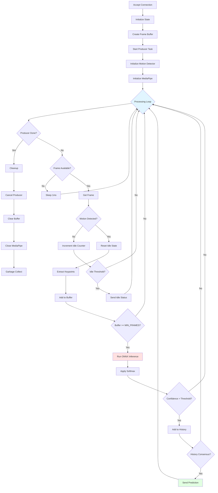
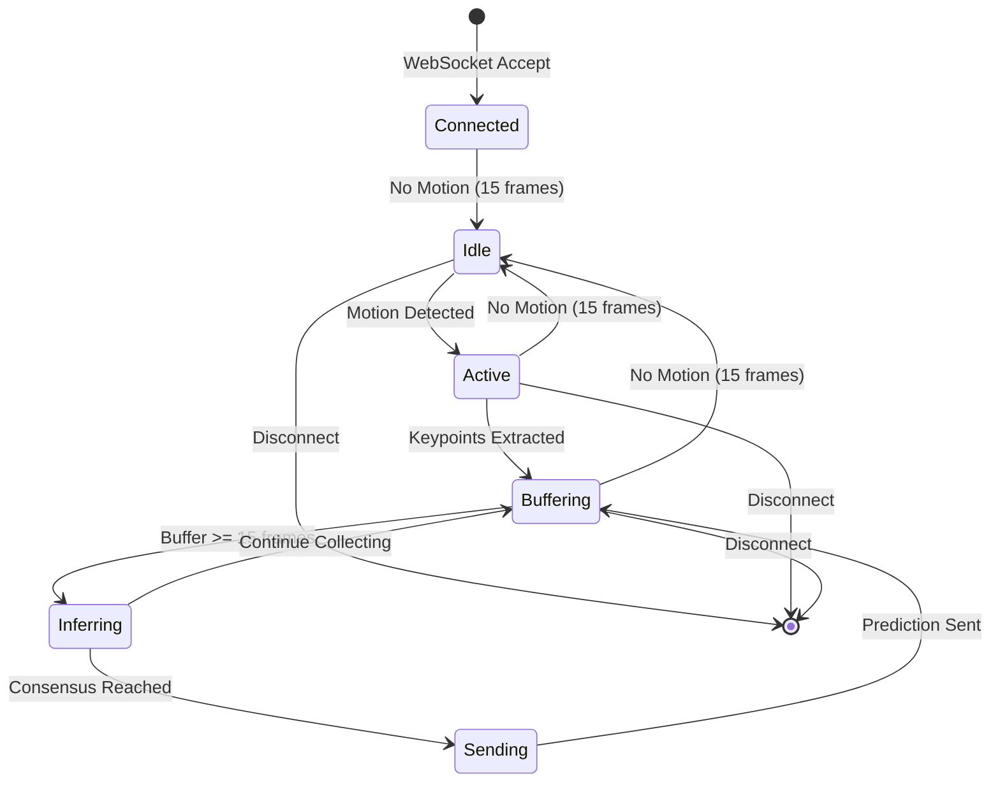

# source/api/websocket.py

#source-code #api #websocket #real-time

**File Path**: `src/api/websocket.py`

**Purpose**: WebSocket handler for real-time Arabic sign language detection. Manages frame reception, motion detection, keypoint extraction, and sign classification.

## Overview

This module implements the core real-time recognition pipeline:
1. Receives video frames via WebSocket
2. Buffers frames asynchronously
3. Detects motion to trigger processing
4. Extracts keypoints using MediaPipe
5. Runs ONNX inference for sign classification
6. Sends predictions back to client

## Dependencies

```python
import asyncio
import gc
import time
from collections import Counter, deque
import fastapi
import numpy as np
import torch
from torch import nn
```

**Internal Imports**:
- [[../../source/api/cv2_utils_py#MotionDetector|MotionDetector]] from `api.cv2_utils`
- [[../../source/api/live_processing_py#FrameBuffer|FrameBuffer]], [[source/api/live_processing_py#get_frame_kps|get_frame_kps]], [[source/api/live_processing_py#producer_handler|producer_handler]] from `api.live_processing`
- [[../../source/core/constants_py#SEQ_LEN|SEQ_LEN]] from `core.constants`
- [[../../source/core/mediapipe_utils_py#LandmarkerProcessor|LandmarkerProcessor]] from `core.mediapipe_utils`
- `AR_WORDS`, `EN_WORDS`, `get_default_logger` from [[source/core/utils_py|core.utils]]
- [[../../source/modelling/model_py#onnx_inference|onnx_inference]] from `modelling.model`

## Constants

```python
NUM_IDLE_FRAMES = 15        # Frames without motion before idle state
HISTORY_LEN = 5             # Number of predictions to track
HISTORY_THRESHOLD = 4       # Minimum occurrences for consensus
MIN_SIGN_FRAMES = 15        # Minimum frames for inference
MAX_SIGN_FRAMES = SEQ_LEN   # Maximum frames (50)
CONFIDENCE_THRESHOLD = 0.4  # Minimum confidence to record prediction
EXT_FRAME = ".jpg"          # Frame extension (unused)
```

**Related**:
- [[../../source/core/constants_py#SEQ_LEN|SEQ_LEN]] - Sequence length from constants

## Router

```python
websocket_router = fastapi.APIRouter()
```

**Exported To**:
- [[../../source/api/main_py#Router Inclusion|main.py]] - Included in main FastAPI app

## Functions

### `get_default_state()`

#function #state-management

**Purpose**: Creates initial state dictionary for WebSocket client.

**Parameters**: None

**Returns**: `dict` - Client state dictionary

**Implementation**:
```python
def get_default_state():
    return {
        "is_idle": False,
        "idle_frames_num": 0,
        "sign_history": deque(maxlen=5),
        "last_sent_sign": None,
    }
```

**State Fields**:
- `is_idle` (bool): Whether client is in idle state (no motion)
- `idle_frames_num` (int): Counter for consecutive idle frames
- `sign_history` (deque): Last 5 predictions for consensus
- `last_sent_sign` (int|None): Last sign sent to client (prevents duplicates)

**Called By**:
- [[#ws_live_signs|ws_live_signs()]] - Initializes client state

**Returns To**:
- [[#ws_live_signs|ws_live_signs()]] - Used as `client_state`

---

### `ws_live_signs(websocket: fastapi.WebSocket)`

#function #websocket #async #main-handler

**Type**: WebSocket route handler

**Route**: `WebSocket /live-signs`

**Purpose**: Main WebSocket handler for real-time sign language recognition. Manages the entire processing pipeline from frame reception to prediction delivery.

**Parameters**:
- `websocket` (fastapi.WebSocket): WebSocket connection instance

**Returns**: None (async generator)

**Decorator**:
```python
@websocket_router.websocket("/live-signs")
```

**Implementation Overview**:



**Processing Pipeline**:

#### 1. Connection Setup
```python
await websocket.accept()
client_id = websocket.client
logger.info(f"Connected client: {client_id}")
```

**Calls**:
- `websocket.accept()` - Accepts WebSocket connection

#### 2. State Initialization
```python
client_buffer = []
client_state = get_default_state()
frame_buffer = FrameBuffer(MAX_SIGN_FRAMES)
producer_task = asyncio.create_task(producer_handler(websocket, frame_buffer))
motion_detector = MotionDetector()
mp_processor: LandmarkerProcessor = await LandmarkerProcessor.create(True)
```

**Calls**:
- [[#get_default_state|get_default_state()]] - Creates client state
- [[../../source/api/live_processing_py#FrameBuffer|FrameBuffer()]] - Creates frame buffer
- [[../../source/api/live_processing_py#producer_handler|producer_handler()]] - Starts frame reception task
- [[../../source/api/cv2_utils_py#MotionDetector|MotionDetector()]] - Creates motion detector
- [[../../source/core/mediapipe_utils_py#LandmarkerProcessor.create|LandmarkerProcessor.create()]] - Initializes MediaPipe

#### 3. Main Processing Loop
```python
while True:
    if producer_task.done():
        break
    
    if frame_buffer.latest_idx < current_proc_idx:
        await asyncio.sleep(0.001)
        continue
    
    # Get frame and process...
```

**Loop Logic**:
- Checks if producer task is still running
- Waits for new frames if buffer is empty
- Processes frames sequentially

#### 4. Motion Detection
```python
has_motion, gray = await asyncio.to_thread(
    motion_detector.detect, prev_gray, frame
)
```

**Calls**:
- [[../../source/api/cv2_utils_py#MotionDetector.detect|motion_detector.detect()]] - Detects motion

**Behavior**:
- If no motion for `NUM_IDLE_FRAMES` (15): Send idle status, clear buffers
- If motion detected: Reset idle counter, proceed to keypoint extraction

#### 5. Keypoint Extraction
```python
kps = await get_frame_kps(mp_processor, frame, now_ms)
client_buffer.append(kps)
```

**Calls**:
- [[../../source/api/live_processing_py#get_frame_kps|get_frame_kps()]] - Extracts keypoints asynchronously

**Buffer Management**:
- Maintains buffer between `MIN_SIGN_FRAMES` (15) and `MAX_SIGN_FRAMES` (50)
- Trims old frames if buffer exceeds maximum

#### 6. Inference
```python
input_kps = np.array(client_buffer, dtype=np.float32)
input_kps = input_kps.reshape(1, input_kps.shape[0], -1)
raw_outputs = await asyncio.to_thread(
    onnx_inference, websocket.app.state.onnx_model, [input_kps]
)
```

**Calls**:
- [[../../source/modelling/model_py#onnx_inference|onnx_inference()]] - Runs ONNX model inference

**Input Shape**: `(1, seq_len, features)`
**Output Shape**: `(1, 502)` - Logits for 502 classes

#### 7. Classification
```python
probs = nn.functional.softmax(torch.Tensor(raw_outputs), dim=0)
pred_idx = int(torch.argmax(probs).item())
confidence = probs[pred_idx].item()

if confidence > CONFIDENCE_THRESHOLD:
    client_state["sign_history"].append(pred_idx)
```

**Calls**:
- `torch.nn.functional.softmax()` - Converts logits to probabilities
- `torch.argmax()` - Gets predicted class

**Confidence Filtering**:
- Only predictions with confidence > 0.4 are added to history

#### 8. Consensus & Response
```python
if len(client_state["sign_history"]) == HISTORY_LEN:
    most_common_sign, sign_count = Counter(
        client_state["sign_history"]
    ).most_common(1)[0]
    if (
        sign_count >= HISTORY_THRESHOLD
        and most_common_sign != client_state["last_sent_sign"]
    ):
        client_state["last_sent_sign"] = most_common_sign
        await websocket.send_json(
            {
                "detected_sign": {
                    "sign_ar": AR_WORDS[pred_idx],
                    "sign_en": EN_WORDS[pred_idx],
                },
                "confidence": confidence,
            }
        )
```

**Consensus Logic**:
- Waits for 5 predictions (`HISTORY_LEN`)
- Requires 4/5 agreement (`HISTORY_THRESHOLD`)
- Prevents duplicate sends (checks `last_sent_sign`)

**Response Format**:
```json
{
  "detected_sign": {
    "sign_ar": "Arabic word",
    "sign_en": "English translation"
  },
  "confidence": 0.95
}
```

**Calls**:
- `websocket.send_json()` - Sends prediction to client

**Received By**:
- [[../../source/frontend/live_signs_js#WebSocket Message Handler|live-signs.js]] - Client-side handler

#### 9. Cleanup
```python
finally:
    logger.info(f"Cleaning up resources for {client_id}")
    
    client_buffer = None
    client_state = None
    
    producer_task.cancel()
    try:
        await producer_task
    except asyncio.CancelledError:
        ...
    
    frame_buffer.clear()
    mp_processor.close()
    
    gc.collect()
```

**Calls**:
- `producer_task.cancel()` - Stops frame reception
- [[../../source/api/live_processing_py#FrameBuffer.clear|frame_buffer.clear()]] - Clears frame buffer
- [[../../source/core/mediapipe_utils_py#LandmarkerProcessor.close|mp_processor.close()]] - Closes MediaPipe resources
- `gc.collect()` - Forces garbage collection

**Exception Handling**:
- `WebSocketDisconnect`: Client disconnected normally
- Generic `Exception`: Logs error and cleans up

**Called By**:
- [[../../source/frontend/live_signs_js#WebSocket Connection|live-signs.js]] - Client WebSocket connection

**Calls**:
- [[#get_default_state|get_default_state()]]
- [[../../source/api/live_processing_py#FrameBuffer|FrameBuffer()]]
- [[../../source/api/live_processing_py#producer_handler|producer_handler()]]
- [[../../source/api/cv2_utils_py#MotionDetector|MotionDetector()]]
- [[../../source/core/mediapipe_utils_py#LandmarkerProcessor.create|LandmarkerProcessor.create()]]
- [[../../source/api/cv2_utils_py#MotionDetector.detect|motion_detector.detect()]]
- [[../../source/api/live_processing_py#get_frame_kps|get_frame_kps()]]
- [[../../source/modelling/model_py#onnx_inference|onnx_inference()]]

---

## Performance Characteristics

### Timing
- **Frame Reception**: Async, non-blocking
- **Motion Detection**: ~5-10ms per frame
- **Keypoint Extraction**: ~20-30ms per frame
- **ONNX Inference**: ~10-20ms per sequence
- **Total Latency**: ~50-80ms per prediction

### Memory
- **Frame Buffer**: ~50 frames × 640×480×3 bytes ≈ 46 MB
- **Keypoint Buffer**: ~50 frames × 184 × 4 × 4 bytes ≈ 147 KB
- **MediaPipe Models**: ~10 MB (loaded once)
- **ONNX Model**: ~5 MB (loaded once)

### Concurrency
- **Producer Task**: Runs in parallel with processing loop
- **Keypoint Extraction**: Runs in thread pool executor
- **Inference**: Runs in thread pool executor
- **Motion Detection**: Runs in thread pool executor

## Error Handling

### Connection Errors
```python
except fastapi.WebSocketDisconnect:
    logger.info(f"Disconnected client (consumer): {client_id}")
```

### Processing Errors
```python
except Exception as e:
    logger.error(f"Error detecting sign: {e}")
    continue  # Continue processing
```

### Cleanup Errors
```python
try:
    await producer_task
except asyncio.CancelledError:
    ...  # Expected when cancelling
```

## State Machine



## Related Documentation

**Conceptual**:
- [[../../api/websocket_communication|WebSocket Communication]]
- [[../../api/live_processing_pipeline|Live Processing Pipeline]]
- [[../../core/mediapipe_integration|MediaPipe Integration]]

**Source Code**:
- [[../../source/api/main_py|main.py]] - Includes this router
- [[../../source/api/live_processing_py|live_processing.py]] - Frame buffer and processing
- [[../../source/api/cv2_utils_py|cv2_utils.py]] - Motion detection
- [[../../source/core/mediapipe_utils_py|mediapipe_utils.py]] - Keypoint extraction
- [[../../source/modelling/model_py|model.py]] - ONNX inference
- [[../../source/frontend/live_signs_js|live-signs.js]] - Client-side WebSocket

---

**File Location**: `../../../src/api/websocket.py`

**Lines of Code**: 182

**Last Updated**: 2026-01-27
