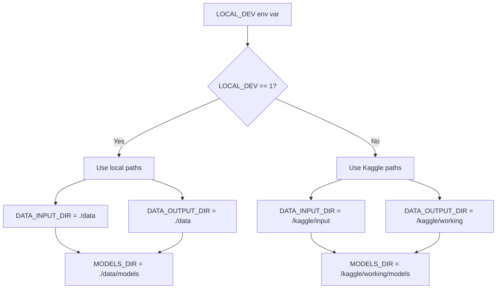

# constants.py

#source #core #configuration #constants

**File Path**: `src/core/constants.py`

**Purpose**: System-wide constants, configuration values, and path definitions.

## Overview

Central configuration module that defines:
- Device configuration (CPU/GPU)
- Directory paths (local vs Kaggle)
- Model hyperparameters
- Dataset parameters
- Enumerations for data types

## Environment Variables

### `USE_CPU`
**Type**: String ("0" or "1")
**Default**: "0"
**Purpose**: Force CPU execution even if GPU available
**Used By**: [[#DEVICE|DEVICE]] constant

### `LOCAL_DEV`
**Type**: String ("0" or "1")
**Default**: "0"
**Purpose**: Switch between local and Kaggle paths
**Used By**: [[#DATA_INPUT_DIR|DATA_INPUT_DIR]], [[#DATA_OUTPUT_DIR|DATA_OUTPUT_DIR]]

## Constants

### Device Configuration

#### `DEVICE`
```python
use_gpu = os.environ.get("USE_CPU", "0") == "0" and cuda_is_available()
DEVICE = ["cpu", "cuda"][int(use_gpu)]
```
**Type**: str ("cpu" or "cuda")
**Purpose**: Execution device for PyTorch/ONNX
**Used By**: All model loading and training functions

### Directory Paths

#### `PROJECT_ROOT_DIR`
**Type**: Path string
**Value**: Parent directory of `src/`
**Purpose**: Base directory for all relative paths

#### `LOGS_DIR`
**Type**: Path string
**Value**: `{PROJECT_ROOT_DIR}/logs`
**Purpose**: Application logs storage

#### `LANDMARKERS_DIR`
**Type**: Path string
**Value**: `{PROJECT_ROOT_DIR}/landmarkers`
**Purpose**: MediaPipe model files (.task files)
**Used By**: [[../../source/core/mediapipe_utils_py|mediapipe_utils.py]]

#### `MODELS_DIR`
**Type**: Path string
**Value**: `{DATA_OUTPUT_DIR}/models`
**Purpose**: ONNX model storage
**Used By**: [[../../source/api/main_py#lifespan|main.py lifespan()]]

#### `TRAIN_CHECKPOINTS_DIR`
**Type**: Path string
**Value**: `{DATA_OUTPUT_DIR}/checkpoints`
**Purpose**: PyTorch training checkpoints
**Used By**: [[../../source/modelling/train_py|train.py]]

#### `DATA_INPUT_DIR`
**Type**: Path string
**Value**: `/kaggle/input` or `{PROJECT_ROOT_DIR}/data` (based on LOCAL_DEV)
**Purpose**: Input data directory

#### `DATA_OUTPUT_DIR`
**Type**: Path string
**Value**: `/kaggle/working` or `{PROJECT_ROOT_DIR}/data` (based on LOCAL_DEV)
**Purpose**: Output data directory

### Dataset Paths

#### `LABELS_PATH`
**Type**: Path string
**Value**: `{PROJECT_DATA_DIR}/KARSL-502_Labels.xlsx`
**Purpose**: Excel file with sign labels

#### `LABELS_JSON_PATH`
**Type**: Path string
**Value**: `{PROJECT_DATA_DIR}/KARSL-502_Labels.json`
**Purpose**: JSON version of labels

#### `KARSL_DATA_DIR`
**Type**: Path string
**Value**: `{DATA_INPUT_DIR}/karsl-502`
**Purpose**: Raw video dataset directory

#### `NPZ_KPS_DIR`
**Type**: Path string
**Value**: `{DATA_INPUT_DIR}/word-level-arabic-sign-language-extrcted-keypoints/karsl-kps`
**Purpose**: Extracted keypoints in NPZ format

#### `MMAP_PREPROCESSED_DIR`
**Type**: Path string
**Value**: `{DATA_INPUT_DIR}/word-level-arabic-sign-language-preprcsd-keypoints`
**Purpose**: Memory-mapped preprocessed keypoints

### Model Hyperparameters

#### `SEQ_LEN`
**Type**: int
**Value**: 50
**Purpose**: Maximum sequence length for model input
**Used By**: All model and dataset code

#### `FEAT_NUM`
**Type**: int
**Value**: 184
**Purpose**: Number of keypoint features (pose + face + hands)
**Calculation**: POSE_NUM + FACE_NUM + 2 * HAND_NUM

#### `FEAT_DIM`
**Type**: int
**Value**: 4
**Purpose**: Dimensions per keypoint (x, y, z, visibility)

### Performance

#### `MAX_WORKERS`
**Type**: int
**Value**: 4
**Purpose**: Thread pool size for keypoint extraction
**Used By**: [[../../source/api/live_processing_py#Thread Pool|live_processing.py]]

### Timing

#### `MS_30FPS`
**Type**: float
**Value**: 1000 / 30 ≈ 33.33
**Purpose**: Milliseconds per frame at 30 FPS

#### `MS_30FPS_INT`
**Type**: int
**Value**: 1000 // 30 = 33
**Purpose**: Integer milliseconds per frame

## Enumerations

### `SplitType`

#enum #dataset

**Purpose**: Dataset split types

**Values**:
- `train`: Training split
- `val`: Validation split
- `test`: Test split

**Usage**:
```python
from core.constants import SplitType

split = SplitType.train
```

### `DatasetType`

#enum #dataset

**Purpose**: Dataset implementation types

**Values**:
- `lazy`: Lazy loading dataset
- `mmap`: Memory-mapped dataset

**Usage**:
```python
from core.constants import DatasetType

dataset_type = DatasetType.mmap
```

## Type Aliases

### `KarslDatasetType`

**Definition**:
```python
type KarslDatasetType = "LazyKArSLDataset" | "MmapKArSLDataset"
```

**Purpose**: Type hint for dataset classes

## Path Configuration Logic



## Usage Examples

### Accessing Paths
```python
from core.constants import MODELS_DIR, LABELS_PATH

# Load model
model_path = os.path.join(MODELS_DIR, "model.onnx")

# Load labels
labels_df = pd.read_excel(LABELS_PATH)
```

### Device Configuration
```python
from core.constants import DEVICE
import torch

# Create tensor on configured device
tensor = torch.zeros(10, 10).to(DEVICE)
```

## Related Documentation

**Used By**:
- [[../../source/api/main_py|main.py]] - MODELS_DIR
- [[../../source/api/live_processing_py|live_processing.py]] - MAX_WORKERS
- [[../../source/api/websocket_py|websocket.py]] - SEQ_LEN
- [[../../source/core/mediapipe_utils_py|mediapipe_utils.py]] - LANDMARKERS_DIR
- [[../../source/modelling/model_py|model.py]] - DEVICE, SEQ_LEN, FEAT_DIM
- All data modules - Dataset paths and constants

**Conceptual**:
- [[../../deployment/environment_configuration|Environment Configuration]]
- [[../../data/dataset_overview|Dataset Overview]]
