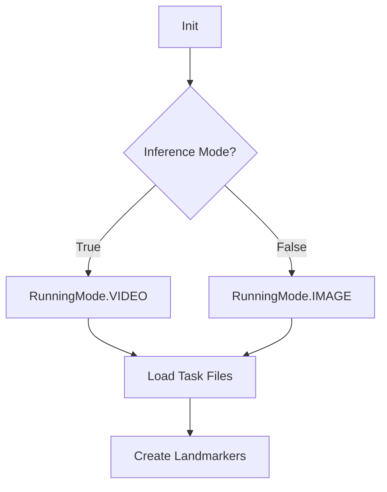

# mediapipe_utils.py

#source #core #mediapipe #vision

**File Path**: `src/core/mediapipe_utils.py`

**Purpose**: Wrappers for MediaPipe solutions to extract Pose, Face, and Hand landmarks.

## Overview

Handles the initialization and concurrent execution of MediaPipe's `PoseLandmarker`, `FaceLandmarker`, and `HandLandmarker`. It normalizes the extraction process across different input types (Image vs Video).

## Setup Logic

### Key Features
- **Concurrent Extraction**: Uses `ThreadPoolExecutor` to run landmarkers in parallel.
- **Normalization**: Indices mapping for specific body parts.
- **Async Creation**: `create_async` supports asynchronous initialization for non-blocking startup using `asyncio.to_thread`.
- **Reduced Representation**: Supports simplified face and hand keypoints for efficient processing.

## Constants

### Keypoint Counts
- `POSE_NUM`: 6 (Shoulders, Elbows, Wrists)
- `FACE_NUM`: 468 (Full FaceMesh) + Iris
- `HAND_NUM`: 21 (Standard Hand Model)

### Slicing
`KP2SLICE` dictionary maps body parts to indices in the flattened feature vector:
- `pose`: `[0:POSE_NUM]`
- `face`: `[POSE_NUM:POSE_NUM+FACE_NUM]`
- `rh`: `[...:...+HAND_NUM]`
- `lh`: `[...:...+HAND_NUM]`

### Reduced Representations
- `reduced_face_kps`: Subset of face landmarks based on `simplified_face_connections.json`.
- `reduced_hand_kps`: Subset of hand landmarks (11 points per hand).
- `reduced_mp_kps_idx_view`: Global view of all selected keypoints.

## Classes

### `LandmarkerProcessor`

**Purpose**: Singleton-like manager for MediaPipe instances.

#### `__init__`
Initializes logger and definition references.

#### `create(landmarkers, inference_mode)`
**Parameters**:
- `landmarkers`: List of strings (e.g., `["pose", "face"]`).
- `inference_mode`: `True` for Video (stateful), `False` for Image (stateless).
**Returns**: Initialized instance.

#### `create_async(landmarkers, inference_mode)`
**Purpose**: Asynchronous version of `create`.

#### `extract_frame_keypoints(frame_rgb, timestamp_ms=-1, adjusted=False, return_both=False)`
**Core Logic**:
1. Defines nested functions (`get_pose`, `get_face`, `get_hands`) to capture local state.
2. Submits tasks to `ThreadPoolExecutor(max_workers=3)`.
3. Waits for all results.
4. Aggregates results into a single `(N, 4)` numpy array `[x, y, z, visibility]`.
5. **Adjusted Mode**: If `True`, normalizes points relative to a reference (e.g., Nose) and scales by a body-part metric (e.g., Shoulder width).
6. **Return Both**: If `True`, returns both adjusted and raw keypoints.

## Related Documentation

**Depends On**:
- [[constants_py|constants.py]] - `LANDMARKERS_DIR`.

**Used By**:
- [[../data/prepare_npz_kps_py|prepare_npz_kps.py]] - Data ingestion.
- [[../api/live_processing_py|live_processing.py]] - Real-time inference.
