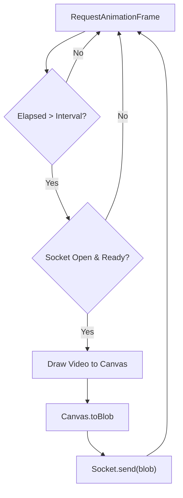

# live_signs.js

#source #frontend #javascript #websocket

**File Path**: `static/live-signs.js`

**Purpose**: Manages the client-side logic for frame capture, WebSocket communication, UI updates, and session management.

## Frame Processing Loop Diagram



## State Management

Maintains the application state in a global object:
```javascript
let state = {
    sessionId: new Date().toISOString(), // Unique session tracking
    isSocketOpen: false,                 // Connection status
    isSending: false,                    // Backpressure control
    lastFrameTime: 0,                    // FPS throttling
    lastFrameWord: "",                   // Stability filtering
    sentenceBuffer: [],                  // Accumulated sentence
    stabilityCounter: 0                  // Consecutive frame counter
};
```

## Configuration (`CONFIG`)

- **`wsUrl`**: WebSocket Endpoint (`ws://host/live-signs`).
- **`fps`**: Target frame rate (30).
- **`processWidth`**: Canvas width for resizing frames before sending (320px).
- **`jpgQuality`**: JPEG compression level (0.7).

## Functions

### `setupWebcam()`
 Initializes `navigator.mediaDevices.getUserMedia`.
 - **Constraints**: `facingMode: "user"`, `width: {ideal: 640}`.
 - **Event**: Sets canvas dimensions on `loadedmetadata`.

### `socket.onmessage(event)`
 Handles inference results from the backend.
 - **Input**: JSON `{detected_sign, confidence, status}`.
 - **Logic**:
   1. Updates Confidence Meter.
   2. **Stability Check**: Increments counter if sign matches `lastFrameWord`.
   3. **Threshold Reached**:
      - Updates Main Display.
      - Triggers TTS (`speakText`).
      - Appends to Sentence Buffer.
      - Logs to History.

### `updateUI(data)`
 Central rendering function.
 - Handles "Idle" state vs "Active" detection.
 - Color-codes confidence bar (Green > 80%, Orange > 50%, Red < 50%).

### `saveCurrentSession()`
 Persists session history to `localStorage`.
 - **Key**: `slr_sessions`.
 - **Limit**: Keeps last 20 sessions.

## UI Interactions
- **History Sidebar**: Toggles with `history-toggle`.
- **Settings Modal**: Controls Theme (Dark/Light) and TTS Language.
- **Archive Modal**: View past sessions.

## Related Documentation

**Connects To**:
- [[../api/websocket_py|websocket.py]] - The backend endpoint receiving the blobs.
- [[../frontend/index_html|index.html]] - The DOM elements manipulated.
