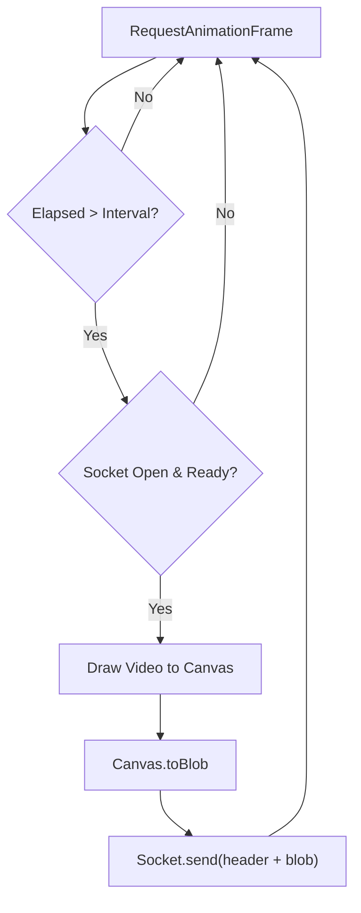

# live_signs.js

#source #frontend #javascript #websocket #skeleton #visualization

**File Path**: `static/live-signs.js`

**Purpose**: Manages the client-side logic for frame capture, WebSocket communication, UI updates, skeleton visualization, and session management.

## Frame Processing Loop Diagram



## State Management

Maintains the application state in a global object:
```javascript
let state = {
    sessionId: new Date().toISOString(), // Unique session tracking
    isSocketOpen: false,                 // Connection status
    isSending: false,                    // Backpressure control
    lastFrameTime: 0,                    // FPS throttling
    lastFrameWord: "",                   // Stability filtering
    sentenceBuffer: [],                  // Accumulated sentence
    stabilityCounter: 0                  // Consecutive frame counter
};
```

## Configuration (`CONFIG`)

- **`wsUrl`**: WebSocket Endpoint (`ws://host/live-signs`).
- **`fps`**: Target frame rate (30).
- **`processWidth`**: Canvas width for resizing frames before sending (320px).
- **`jpgQuality`**: JPEG compression level (0.7).
- **`viz`**: Visualization settings for `face`, `pose`, `hands`, `lines`, and `points`.

## Core Logic

### Skeleton Visualization
- **`loadSkeletonConfig()`**: Fetches mapping and connection data from `/static/simplified_kps_connections.json`.
- **`drawSkeleton(landmarks)`**: Renders normalized landmarks onto the `overlay-canvas`. Scales points based on canvas dimensions and applies region-specific colors.
- **`toggleViz(region)`**: Toggles visibility of specific body regions (Pose/Face/Hands) and persists to `localStorage`.

### Frame Processing
- **`processFrame()`**: Prepends a 1-byte header to the JPEG blob indicating if landmarks are needed (based on active visualization settings) and sends it via WebSocket.

### `socket.onmessage(event)`
- Handles inference results from the backend.
- **Input**: JSON `{detected_sign, confidence, landmarks, status}`.
- **Logic**:
  1. Triggers `drawSkeleton(data.landmarks)`.
  2. Updates Confidence Meter.
  3. **Stability Check**: Increments counter if sign matches `lastFrameWord`.
  4. **Threshold Reached**: Triggers TTS, updates display, and appends to buffer.

## UI & Session Management
- **`saveCurrentSession()`**: Persists history to `localStorage` (last 20 sessions).
- **Theme Support**: Includes `setTheme('light'|'dark')` with persistence.
- **Text-to-Speech**: Uses `window.speechSynthesis` with configurable language.

## Related Documentation

**Connects To**:
- [[../api/websocket_py|websocket.py]] - The backend endpoint receiving the blobs.
- [[../frontend/index_html|index.html]] - The DOM elements manipulated.
