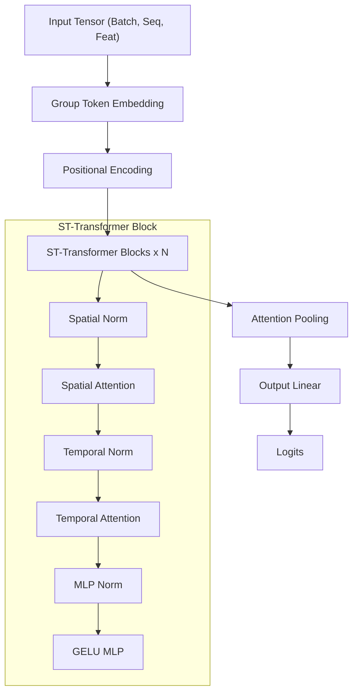

# model.py

#source #modelling #pytorch #transformer #architecture

**File Path**: `src/modelling/model.py`

**Purpose**: Defines the Spatial-Temporal Transformer (ST-Transformer) architecture for sign language recognition.

## System Architecture

The model uses an ST-Transformer which processes data in both spatial (within a frame) and temporal (across time) dimensions.

## Classes

### `GroupTokenEmbedding`
**Purpose**: Transforms raw keypoints into body-part specific tokens.
- **Tokens**: Creates 4 tokens per frame (Pose, Face, Right Hand, Left Hand).
- **Projections**: Each part is projected to `token_dim` using a linear layer.
- **Normalization**: Uses `BatchNorm1d` on input features and `LayerNorm` on tokens.
- **Part Embeddings**: Adds learned embeddings to distinguish body parts.

### `STTransformerBlock`
**Purpose**: Dual-attention block for spatial and temporal modeling.
- **Spatial Attention**: Self-attention over body-part tokens within the same time step.
- **Temporal Attention**: Self-attention over the same body part across different time steps.
- **MLP**: A 2-layer GELU-based feed-forward network.
- **Residual Connections**: Used after each attention and MLP sub-block.

### `PositionalEncoding`
**Purpose**: Adds sinusoidal position signals to the input tokens to provide temporal context.

### `AttentionPooling`
**Purpose**: Aggregates temporal information by weighting frames based on learned importance.

### `STTransformer`
**Purpose**: The full model assembler.
- **Layers**: Configurable through `ModelSize` (Head size, Num heads, Num layers).
- **Output**: Linear layer mapping hidden representations to `num_classes`.

## Functions

### `get_model_instance(num_signs, model_size, device="cpu")`
**Purpose**: Factory function to instantiate the ST-Transformer.

### `load_model(checkpoint_path, ...)`
**Purpose**: Loads a PyTorch checkpoint, extracting model metadata (number of signs, size) from the filename if not provided.

### `onnx_inference(ort_session, input_data)`
**Purpose**: Executes inference using ONNX Runtime.
- **Padding**: Pads sequences shorter than `SEQ_LEN` (50) by repeating the last frame.

## Related Documentation

**Depends On**:
- [[../core/constants_py|constants.py]] - `ModelSize`, `FEAT_DIM`, `SEQ_LEN`.
- [[../core/mediapipe_utils_py|mediapipe_utils.py]] - Body part counts.

**Used By**:
- [[train_py|train.py]] - Model training.
- [[../api/live_processing_py|live_processing.py]] - Online inference.
