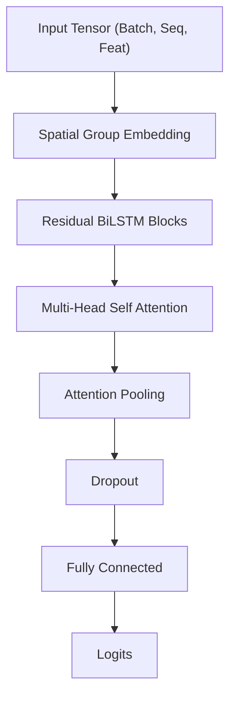

# model.py

#source #modelling #pytorch #architecture

**File Path**: `src/modelling/model.py`

**Purpose**: Definition of the deep learning architecture for sign language recognition.

## System Architecture

The model uses a **Spatial-Temporal** architecture combining embeddings for body parts with BiLSTMs and Attention.



## Classes

### `SpatialGroupEmbedding`
**Purpose**: Embeds raw keypoints into a hidden semantic space, processing distinct body parts separately.
**Input**: `(Batch, Seq, 184 * 4)`
**Logic**:
- **Pose**: Linear Proj -> 40 dim
- **Face**: Linear Proj -> 88 dim
- **Hands**: Linear Proj -> 128 dim (each)
- **Aggregated**: Concatenated (384 dim) -> GELU -> BatchNorm

### `ResidualBiLSTMBlock`
**Purpose**: A single building block for the temporal encoder.
**Components**:
- Bidirectional LSTM
- Dropout
- LayerNorm
- **Residual Connection**: `x + f(x)`

### `AttentionPooling`
**Purpose**: Aggregates the sequence of hidden states into a single vector using learned attention weights.
**Formula**: $\sum (x_t \cdot \text{softmax}(W \cdot x_t))$

### `AttentionBiLSTM`
**Purpose**: Main model class.
**Hyperparameters**:
- `hidden_size`: 384
- `num_lstm_blocks`: 4
- `heads`: 8

## Functions

### `get_model_instance(...)`
Factory function creating a standard model configuration.
```python
def get_model_instance(num_signs, device="cpu") -> AttentionBiLSTM:
```
**Default Params**:
- `hidden_size`: 384
- `dropout`: 0.5 (all types)

### `load_onnx_model(...)`
Initializes an ONNX Runtime Inference Session.
```python
def load_onnx_model(onnx_model_path, device="cpu") -> InferenceSession:
```
**Providers**:
- checks `device="cuda"` to use `CUDAExecutionProvider` or defaults to `CPU`.

### `onnx_inference(...)`
Runs inference on a sequence using the ONNX session.
- **Padding**: Automatically pads input sequence to `SEQ_LEN` (50) by repeating the last frame if necessary.

## Related Documentation

**Depends On**:
- [[../core/constants_py|constants.py]] - `FEAT_DIM`, `SEQ_LEN`
- [[../core/mediapipe_utils_py|mediapipe_utils.py]] - Body part indices

**Used By**:
- [[train_py|train.py]] - Instantiates model for training
- [[../api/websocket_py|websocket.py]] - Inference logic
