# train.py

#source #modelling #training #pytorch

**File Path**: `src/modelling/train.py`

**Purpose**: Training loop implementation supporting mixed precision (AMP) and Distributed Data Parallel (DDP).

## Features

- **Automatic Mixed Precision (AMP)**: Uses `torch.amp.autocast` (bfloat16) and `GradScaler` for faster, memory-efficient training.
- **Distributed Training Support**: Integrates with `parallel_train.py` via `rank` and `train_sampler` parameters.
- **Memory Optimization**: Frequent `gc.collect()` and `torch.cuda.empty_cache()` calls to stay within GPU limits.
- **Checkpointing**: Logic ensures only the master process (`rank <= 0`) saves the best model state when validation loss improves.
- **Diagnostics**: Calls `visualize_metrics` after training to generate performance plots.

## Training Pipeline

```mermaid
sequenceDiagram
    participant Train as Model (Train)
    participant Valid as Model (Eval)
    participant Check as Checkpointer

    loop Every Epoch
        rect rgb(20, 20, 30)
            Note over Train: Training Phase (AMP Enabled)
            Train->>Train: Forward Pass
            Train->>Train: Compute Loss
            Train->>Train: Scaled Backward
            Train->>Train: Clip Gradients
            Train->>Train: Optimizer Step
        end

        rect rgb(30, 20, 20)
            Note over Valid: Validation Phase
            Valid->>Valid: Forward (No Grad)
            Valid->>Valid: All-Reduce Loss (if DDP)
        end
        
        opt Val Loss < Best Loss (Master Rank Only)
            Check-->>Check: Save .pth Checkpoint
        end
    end
```



---

## Key Functions

### `train(...)`

```python
def train(
    model, loss, optimizer, scheduler, train_dl, val_dl, num_epochs, 
    device=DEVICE, rank=-1, train_sampler: Optional[DistributedSampler] = None
):
```

**Workflow**:
1. **Setup**: Initializes `GradScaler`. On master rank, creates a timestamped checkpoint directory.
2. **Epoch Loop**:
   - **Train Phase**: Iterates `train_dl`. If `train_sampler` is provided, calls `set_epoch`. Performs AMP-scaled optimization.
   - **Eval Phase**: Iterates `val_dl`. If distributed, used `dist.all_reduce` to sync validation loss across GPUs.
   - **Checkpoint**: Master rank saves the model if `val_loss` improves.
   - **Scheduler**: Updates learning rate via `ReduceLROnPlateau`.

**Returns**: Path to the best checkpoint file (on master rank).

## Execution (`__main__`)

Parses command line arguments for sign range, epochs, and model size, then initiates the training and visualization flow.

```bash
python src/modelling/train.py --selected_signs_to 502 --num_epochs 50
```

## Related Documentation

- [[../data/dataloader_py|dataloader.py]] - Data providers
- [[model_py|model.py]] - Network architecture and save/load logic
- [[visualize_model_performance_py|visualize_model_performance.py]] - Automated post-training analysis
