# train.py

#source #modelling #training #pytorch

**File Path**: `src/modelling/train.py`

**Purpose**: Training loop implementation supporting mixed precision and distributed training.

## Features
- **Automatic Mixed Precision (AMP)**: Uses `torch.amp.autocast` (bfloat16) and `GradScaler`.
- **Distributed Data Parallel (DDP)**: Supports multi-GPU training via `rank` parameter.
- **Checkpointing**: Saves model only when validation loss improves.
- **Scheduling**: `ReduceLROnPlateau` for learning rate adjustment.

## Training Pipeline

```mermaid
sequenceDiagram
    participant Train as Model (Train)
    participant Valid as Model (Eval)
    participant Check as Checkpointer

    loop Every Epoch
        rect rgb(20, 20, 30) %% Optional: Dark background for Training
            Note over Train: Training Phase
            Train->>Train: Forward (Autocast)
            Train->>Train: Backward (Scaled)
            Train->>Train: Optimizer Step
        end

        rect rgb(30, 20, 20) %% Optional: Dark background for Validation
            Note over Valid: Validation Phase
            Valid->>Valid: Forward (No Grad)
        end
        
        opt Val Loss < Best Loss
            Check-->>Check: Save State Dict
        end
    end
```



## Functions

### `train(...)`

```python
def train(model, loss, optimizer, scheduler, train_dl, val_dl, num_epochs, ...):
```

**Workflow**:
1. **Setup**: Initializes `GradScaler` and Checkpoint directory.
2. **Epoch Loop**:
   - **Train Phase**: Iterates `train_dl`. Updates weights. Logs loss.
   - **Eval Phase**: Iterates `val_dl`. Aggregates global metrics (if DDP).
   - **Checkpoint**: Saves `state_dict` if `val_loss < best_val_loss`.
   - **Scheduler**: Steps based on `val_loss`.

**Returns**: Path to the best checkpoint file.

## Execution (`__main__`)

Allows executing training directly as a script.
- **Defaults**:
  - `num_epochs`: 1
  - `lr`: 1e-3
  - `weight_decay`: 1e-4

```bash
python -m src.modelling.train
```

## Related Documentation

**Depends On**:
- [[../../source/data/dataloader_py|dataloader.py]] - Data providers
- [[../../source/modelling/model_py|model.py]] - Model Architecture
- [[../../source/core/constants_py|constants.py]] - `DEVICE`

**Conceptual**:
- [[../../models/training_process|Training Process Overview]]
